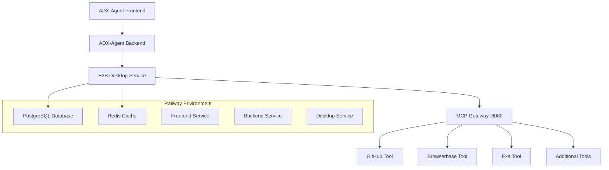

# MCP (Model Context Protocol) Integration for ADX-Agent

## 🚀 Overview

ADX-Agent now includes **Model Context Protocol (MCP)** integration, providing access to **200+ tools** including GitHub, Browserbase, Exa, and more! This transforms ADX-Agent into a super-powered coding assistant with access to virtually any tool or service.

## 🎯 What is MCP?

**Model Context Protocol (MCP)** is an open standard for connecting AI models to external tools and data sources. E2B provides a **batteries-included MCP gateway** that runs inside sandboxes, giving you type-safe access to tools through a unified interface.

## 🔧 Available MCP Tools

### **Core Tools (Pre-configured)**
- **GitHub** - Repository management, issues, PRs, branch operations
- **Browserbase** - Advanced web automation, testing, AI-powered interactions  
- **Exa** - AI-powered search and research, content extraction

### **Additional Tools (Available)**
- **Notion** - Workspace integration and documentation
- **Stripe** - Payment processing and billing
- **Airtable** - Database and spreadsheet integration
- **+ 195+ more tools** from the Docker MCP Catalog

## 🏗️ Architecture



## ⚙️ Configuration

### **Railway Secrets Required**

Configure these secrets in your Railway project settings:

```bash
# Core MCP Tools
GITHUB_TOKEN=ghp_your_github_personal_access_token
BROWSERBASE_API_KEY=your_browserbase_api_key
BROWSERBASE_PROJECT_ID=your_browserbase_project_id
EXA_API_KEY=your_exa_api_key

# AI Integration
GOOGLE_GENERATIVE_AI_API_KEY=your_gemini_api_key

# E2B Integration
E2B_API_KEY=your_e2b_api_key
```

### **Getting API Keys**

#### **GitHub Token**
1. Go to GitHub Settings → Developer settings → Personal access tokens
2. Create token with scopes: `repo`, `user`, `admin:org`
3. Copy token and add to Railway secrets

#### **Browserbase API Key**
1. Sign up at [Browserbase](https://www.browserbase.com/)
2. Get API key from dashboard
3. Create project and note Project ID
4. Add both to Railway secrets

#### **Exa API Key**
1. Sign up at [Exa](https://exa.ai/)
2. Get API key from dashboard
3. Add to Railway secrets

## 🚀 Deployment

### **Automatic Integration**

The MCP integration is **automatically included** in Railway deployments:

1. **Desktop Service** includes MCP gateway startup
2. **Environment Variables** are configured via Railway secrets
3. **Health Checks** validate MCP gateway functionality
4. **Monitoring** tracks MCP tool availability

### **Manual Deployment**

```bash
# Deploy with MCP integration
railway up --service adx-agent-desktop

# Check MCP status
curl https://your-desktop-service.railway.app/mcp/status
```

## 📊 MCP Gateway Endpoints

### **Health Check**
```bash
GET /health
# Returns MCP gateway status
```

### **Tool Status**
```bash
GET /mcp/status
# Returns detailed status of all tools
```

### **Tool List**
```bash
GET /tools
# Returns list of available MCP tools
```

### **Tool Execution**
```bash
POST /tools/{tool_name}/execute
# Execute specific MCP tool
```

## 🔧 Usage Examples

### **GitHub Operations**
```python
# Example: Create issue
response = requests.post(
    "http://localhost:8080/tools/github/execute",
    json={
        "action": "create_issue",
        "repository": "owner/repo",
        "title": "Bug fix needed",
        "body": "Description of the issue"
    }
)
```

### **Browserbase Web Automation**
```python
# Example: Take screenshot
response = requests.post(
    "http://localhost:8080/tools/browserbase/execute",
    json={
        "action": "screenshot",
        "url": "https://example.com",
        "options": {
            "fullPage": True,
            "waitFor": "networkidle"
        }
    }
)
```

### **Exa Search**
```python
# Example: Search and extract content
response = requests.post(
    "http://localhost:8080/tools/exa/execute",
    json={
        "action": "search",
        "query": "ADX-Agent coding assistant features",
        "options": {
            "numResults": 10,
            "contentType": "html"
        }
    }
)
```

## 🛠️ Integration with ADX-Agent Frontend

### **MCP Tool Selection Interface**
The ADX-Agent frontend can display available MCP tools:

```typescript
interface MCPTool {
  id: string;
  name: string;
  description: string;
  category: string;
  status: 'active' | 'inactive' | 'error';
}

const availableTools: MCPTool[] = [
  {
    id: 'github',
    name: 'GitHub',
    description: 'Repository management',
    category: 'Development',
    status: 'active'
  },
  {
    id: 'browserbase',
    name: 'Browserbase',
    description: 'Web automation',
    category: 'Testing',
    status: 'active'
  },
  {
    id: 'exa',
    name: 'Exa',
    description: 'AI search',
    category: 'Research',
    status: 'active'
  }
];
```

### **Backend API Integration**
```python
# Backend endpoint for MCP tool execution
@app.post("/api/mcp/execute")
async def execute_mcp_tool(tool_name: str, params: dict):
    """Execute MCP tool via desktop service"""
    mcp_url = f"http://desktop-service.railway.internal:8080/tools/{tool_name}/execute"
    
    response = requests.post(mcp_url, json=params)
    return response.json()
```

## 📈 Monitoring & Observability

### **MCP Status Dashboard**
Access the MCP status endpoint:
```
https://your-desktop-service.railway.app/mcp/status
```

**Status includes:**
- Gateway health status
- Individual tool availability
- Connection counts
- Error rates
- Performance metrics

### **Logging**
MCP gateway logs are available in Railway logs:
```bash
railway logs --service adx-agent-desktop --follow
```

### **Health Checks**
Railway automatically monitors:
- Desktop service health (`/health`)
- MCP gateway status (`/mcp/status`)
- Individual tool availability

## 🔒 Security Considerations

### **API Key Management**
- All API keys stored as Railway secrets
- Keys are environment-specific
- No keys in source code or configuration files

### **Network Security**
- MCP gateway runs on internal Railway network
- Tools communicate via Railway's private networking
- External API calls are proxied through desktop service

### **Access Control**
- MCP gateway includes authentication
- CORS enabled for frontend integration
- Rate limiting configured per tool

## 🛠️ Troubleshooting

### **Common Issues**

#### **MCP Gateway Not Starting**
```bash
# Check logs
railway logs --service adx-agent-desktop | grep MCP

# Verify environment variables
railway variables --service adx-agent-desktop

# Test manually
curl http://localhost:8080/health
```

#### **Tool Connection Failures**
```bash
# Check tool status
curl http://localhost:8080/mcp/status

# Verify API keys
railway variables --service adx-agent-desktop | grep API_KEY

# Test individual tools
curl http://localhost:8080/tools/github/health
```

#### **High Memory Usage**
- MCP tools run in isolated processes
- Monitor memory usage in Railway dashboard
- Consider scaling desktop service horizontally

### **Debug Commands**

```bash
# SSH into desktop service
railway shell --service adx-agent-desktop

# Check MCP processes
ps aux | grep mcp

# Test MCP gateway
curl -v http://localhost:8080/health

# Check tool configurations
cat /app/config/mcp-config.json
```

## 🚀 Advanced Features

### **Custom MCP Tools**
Add custom MCP tools to `/app/config/tools/`:
```yaml
# custom-tool.yml
custom_tool:
  server:
    name: "custom-tool"
    source: "github.com/your-org/custom-mcp"
  environment:
    CUSTOM_API_KEY: "${CUSTOM_API_KEY}"
```

### **Tool-Specific Configuration**
Modify tool behavior in `/app/config/tools/`:
```yaml
# github.yml - Enhanced configuration
github:
  rateLimit:
    requests: 5000
    window: "1minute"
  features:
    - "repository_webhooks"
    - "workflow_automation"
```

### **Performance Optimization**
- Enable tool caching for frequently used operations
- Configure timeouts per tool type
- Monitor and optimize memory usage

## 📚 Additional Resources

- [E2B MCP Documentation](https://docs.e2b.com/mcp/)
- [Model Context Protocol](https://modelcontextprotocol.io/)
- [Docker MCP Catalog](https://hub.docker.com/mcp)
- [Railway Deployment Guide](./RAILWAY-DEPLOYMENT.md)

## 🎊 Conclusion

MCP integration transforms ADX-Agent into a **super-powered coding assistant** with access to 200+ tools. This enables:

✅ **Repository Management** - GitHub integration  
✅ **Web Automation** - Browserbase testing  
✅ **AI Research** - Exa-powered search  
✅ **Tool Ecosystem** - 200+ available tools  
✅ **Secure Integration** - Railway-managed secrets  
✅ **Production Ready** - Comprehensive monitoring  

The MCP gateway runs **inside Railway's sandbox environment**, providing secure, isolated access to external tools while maintaining the robustness of the Railway deployment platform.

---

**MCP Integration Version**: 1.0.0  
**Last Updated**: 2025-12-19  
**Author**: MiniMax Agent