# ADX-Agent System Architecture & Sequence Diagrams

## Table of Contents
1. [System Overview](#system-overview)
2. [AI Agent Interaction Flow](#ai-agent-interaction-flow)
3. [Real-time VNC Streaming](#real-time-vnc-streaming)
4. [API Request/Response Flow](#api-requestresponse-flow)
5. [WebSocket Communication](#websocket-communication)
6. [Docker Deployment Workflow](#docker-deployment-workflow)
7. [Database Schema](#database-schema)

## System Overview

### Overall Architecture Sequence

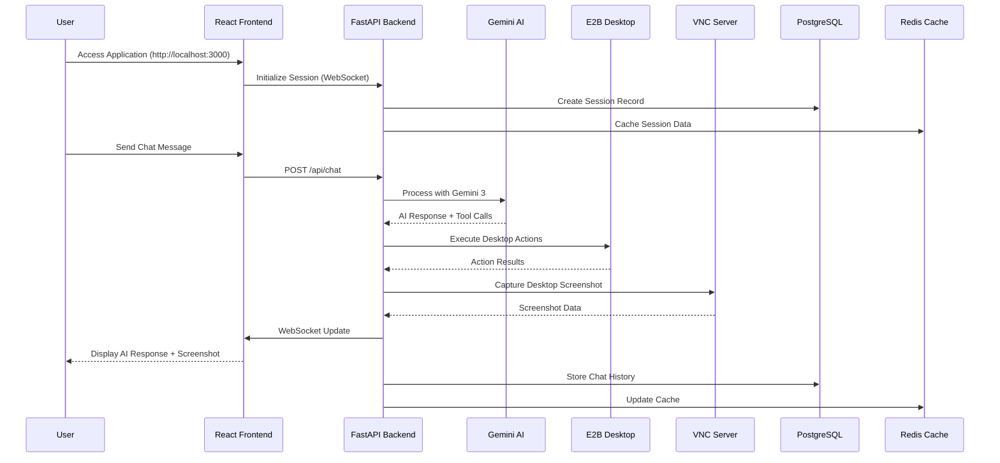

## AI Agent Interaction Flow

### Chat Processing Sequence

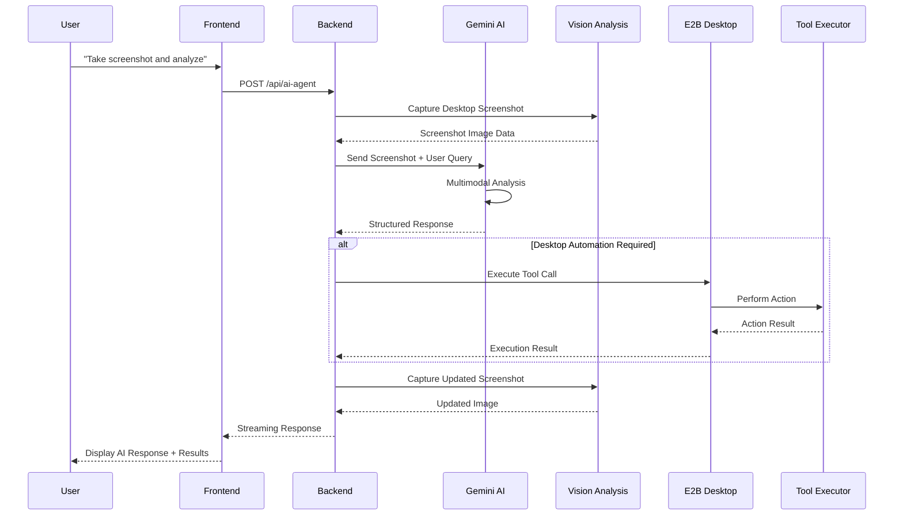

## Real-time VNC Streaming

### VNC Stream Flow

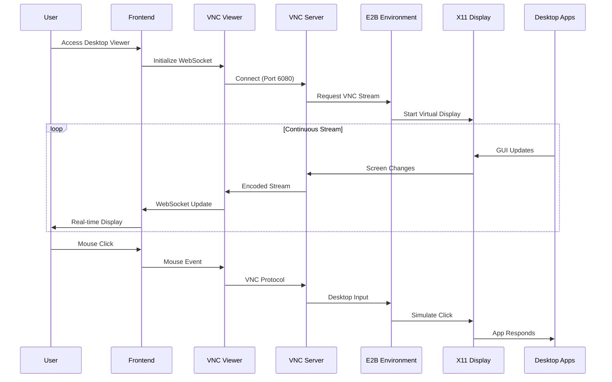

## API Request/Response Flow

### REST API Communication

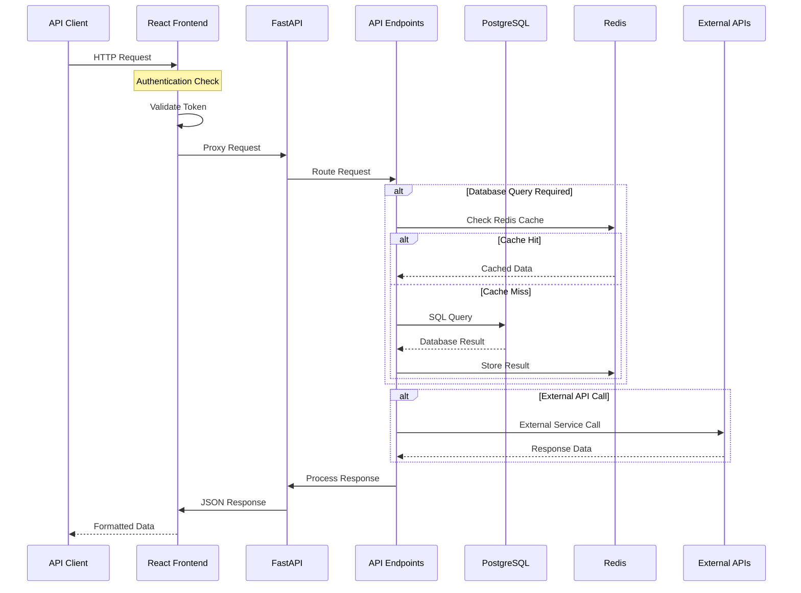

## WebSocket Communication

### Real-time Updates Flow

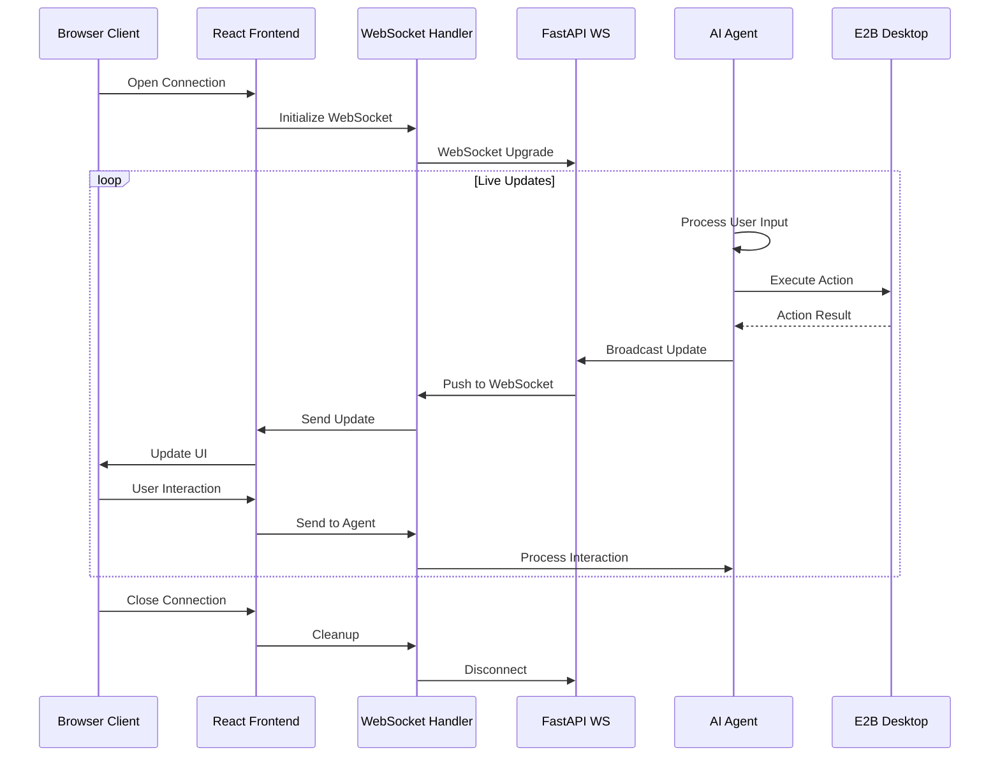

## Docker Deployment Workflow

### Container Orchestration

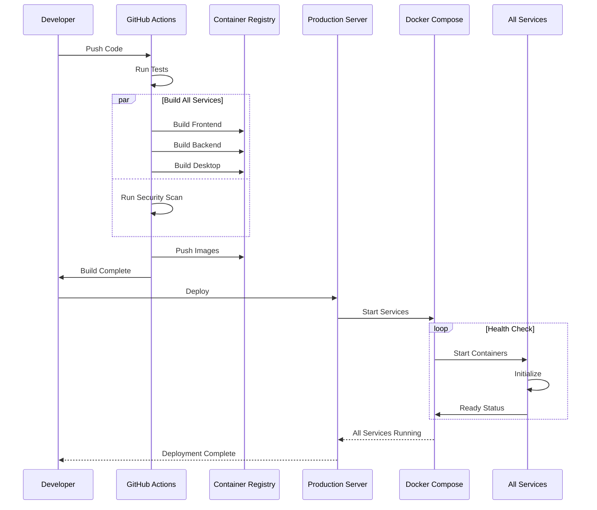

## Database Schema

### Entity Relationship Diagram

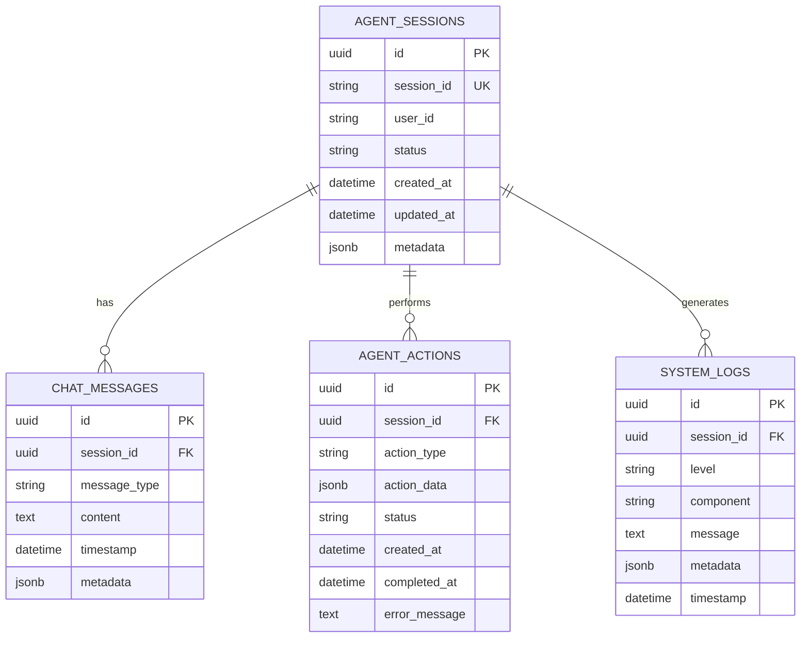

## Component Architecture

### System Components Flow

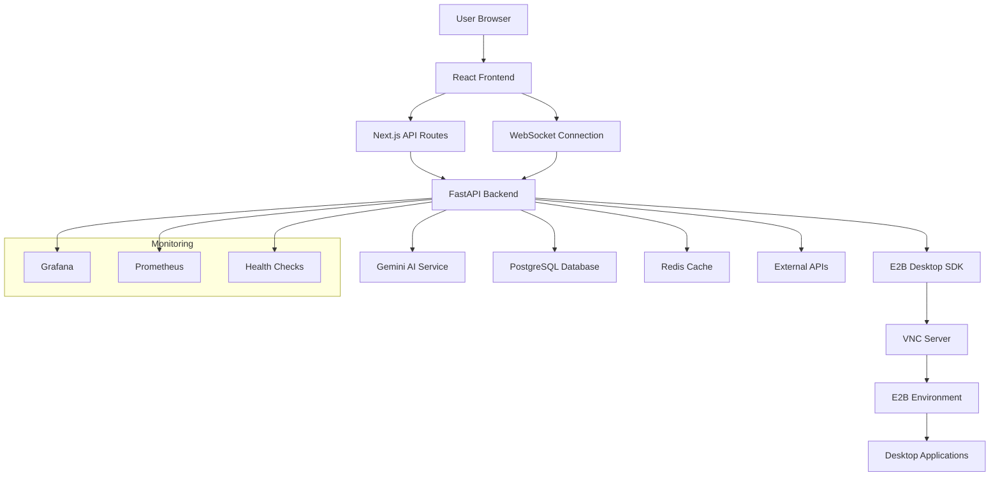

## Performance Monitoring

### Metrics Collection Flow

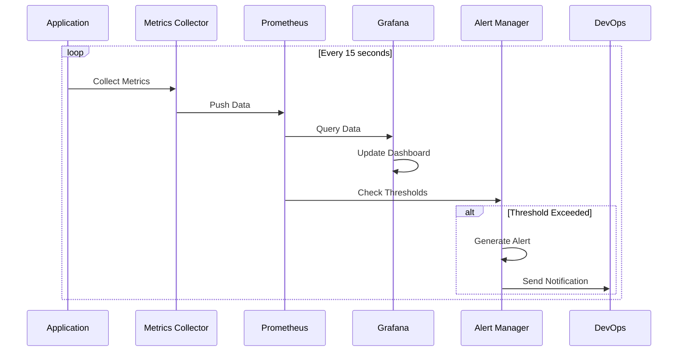

## Error Handling Flow

### Exception Management

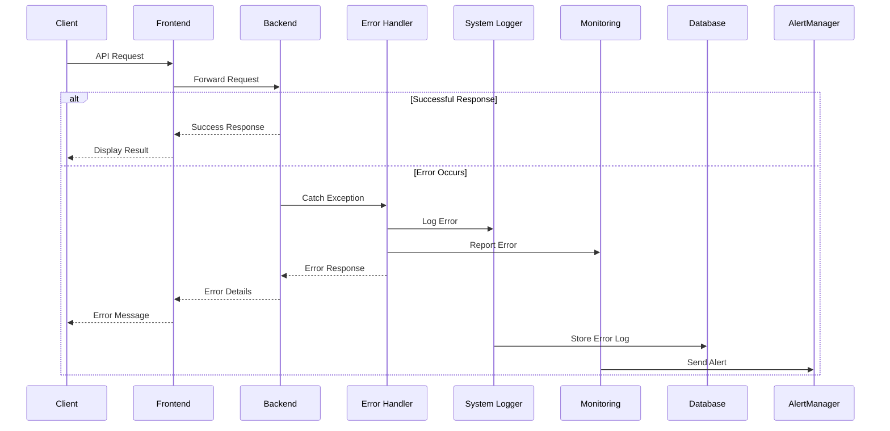

## Security Flow

### Authentication & Authorization

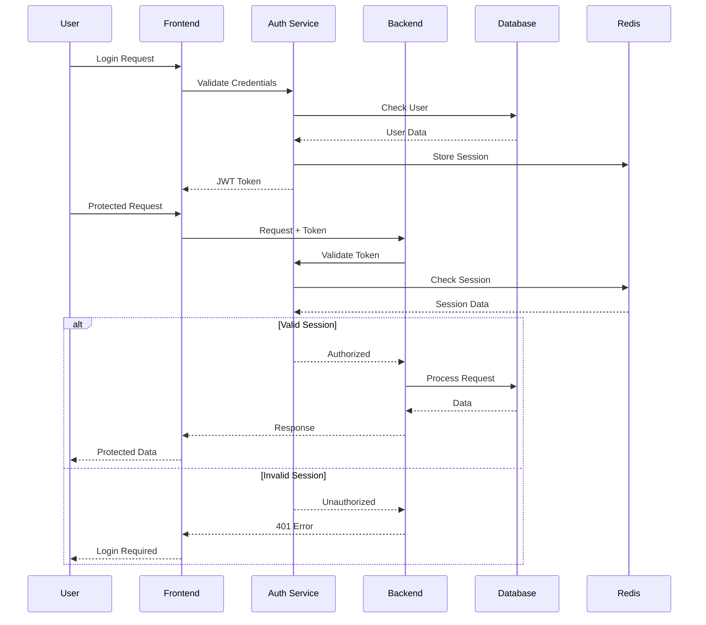

---

## Usage Instructions

### Rendering Mermaid Diagrams

To render these Mermaid diagrams in your documentation:

1. **GitHub/GitLab**: Mermaid diagrams are automatically rendered in markdown files
2. **VS Code**: Install the "Mermaid Preview" extension
3. **Documentation Sites**: Use Mermaid CLI or integration plugins
4. **Websites**: Include Mermaid.js library

### Example Usage in Markdown

```markdown
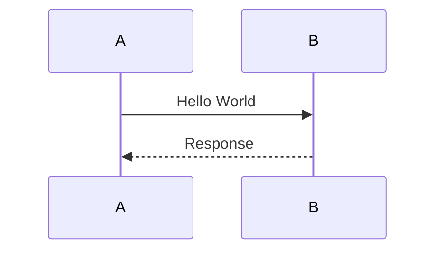
```

### Interactive Features

- **Zoom**: Mouse wheel to zoom in/out
- **Pan**: Click and drag to move around
- **Download**: Right-click to save as SVG/PNG
- **Edit**: Click on nodes to edit in Mermaid live editor

---

**Documentation Version**: 1.0.0  
**Last Updated**: 2025-12-19  
**Author**: MiniMax Agent