# Mermaid Diagrams in ADX-Agent Documentation

## 🎯 Overview

Mermaid diagrams are a powerful way to visualize complex system architectures, data flows, and processes directly in Markdown files. ADX-Agent uses Mermaid for comprehensive documentation.

## 📚 Quick Start

### Basic Syntax


### Rendering in Different Platforms
- **GitHub**: Automatic rendering in .md files
- **GitLab**: Supported in wiki and markdown
- **VS Code**: Install "Mermaid Preview" extension
- **Documentation Sites**: Include Mermaid.js library

## 🔄 ADX-Agent Core Workflows

### 1. User Session Flow


### 2. Real-time VNC Streaming


### 3. AI Agent Reasoning Flow


### 4. API Architecture


### 5. Database Schema


### 6. Docker Deployment


### 7. Error Handling


## 🎨 Diagram Types Used in ADX-Agent

### 1. Sequence Diagrams

```mermaid
sequenceDiagram
    participant User as 👤 User
    participant Frontend as 🌐 Frontend
    participant Backend as ⚡ Backend
    participant AI as 🤖 AI Agent
    
    User->>Frontend: "Take screenshot"
    Frontend->>Backend: Process request
    Backend->>AI: Analyze + Respond
    AI-->>Backend: "Screenshot captured"
    Backend-->>Frontend: Response data
    Frontend-->>User: Display result
```


### 2. Flowcharts

```mermaid
flowchart TD
    A[🎯 User Input] --> B{🔍 Analyze}
    B --> C[🖼️ Take Screenshot]
    C --> D[🧠 AI Processing]
    D --> E{💡 Action Required?}
    
    E -->|Yes| F[🔧 Execute Tools]
    E -->|No| G[💬 Generate Response]
    
    F --> H[✅ Monitor Results]
    H --> I{🎯 Success?}
    I -->|Yes| J[📊 Update State]
    I -->|No| K[🔄 Retry/Adjust]
    
    J --> G
    K --> F
    
    G --> L[💾 Store History]
    L --> M[📤 Send Response]
```


### 3. System Architecture

```mermaid
graph TB
    subgraph "🌐 Frontend Layer"
        A[React 19 + Next.js 14]
        B[Ant Design X UI]
        C[TypeScript + Tailwind]
    end
    
    subgraph "⚡ Backend Layer"
        D[FastAPI Python]
        E[WebSocket Handler]
        F[API Routes]
    end
    
    subgraph "🧠 AI Services"
        G[Google Gemini 3]
        H[E2B Desktop SDK]
    end
    
    subgraph "💾 Data Layer"
        I[PostgreSQL 15]
        J[Redis Cache]
    end
    
    subgraph "🖥️ Desktop Environment"
        K[E2B Sandbox]
        L[VNC Server]
        M[Ubuntu + XFCE]
    end
    
    A --> D
    B --> A
    C --> A
    D --> E
    D --> F
    F --> G
    F --> H
    D --> I
    D --> J
    H --> K
    K --> L
    L --> M
```


### 4. Component Relationships


## 🛠️ Advanced Mermaid Features

### 1. Styling

```mermaid
graph TD
    A[🔵 Start] --> B[🟢 Process]
    B --> C[🟡 Decision]
    C --> D[🔴 End]
    
    classDef startEnd fill:#e1f5fe,stroke:#01579b,stroke-width:2px
    classDef process fill:#e8f5e8,stroke:#2e7d32,stroke-width:2px
    classDef decision fill:#fff3e0,stroke:#f57c00,stroke-width:2px
    
    class A,D startEnd
    class B process
    class C decision
```


### 2. Interactive Elements


### 3. Timeline


## 📋 Usage Guidelines

### 1. In Documentation Files
```markdown
# User Guide

## System Overview
The ADX-Agent follows this workflow:


```

### 2. In API Documentation
```markdown
## API Flow


```

### 3. In Architecture Documents
```markdown
## High-Level Architecture


### 4. Inline Diagrams


## 🔧 Tools and Extensions

### VS Code Extensions
- **Mermaid Preview**: Live preview of diagrams
- **Markdown All in One**: Enhanced markdown editing
- **Markdown Preview Enhanced**: Advanced preview features

### Online Editors
- **Mermaid Live Editor**: https://mermaid.live/
- **GitHub**: Automatic rendering
- **GitLab**: Built-in support

### CLI Tools
```bash
# Generate SVG from Mermaid
npm install -g @mermaid-js/mermaid-cli
mmdc -i input.mmd -o output.svg

# Convert to PNG
mmdc -i input.mmd -o output.png
```

## 📊 Performance Monitoring Diagrams

### System Metrics Flow


## 🎯 Best Practices

### 1. Keep Diagrams Simple
- Use clear, descriptive labels
- Avoid overcrowding with too many elements
- Use consistent color schemes

### 2. Use Appropriate Diagram Types
- **Sequence**: For time-based interactions
- **Flowchart**: For decision processes
- **Graph**: For system architecture
- **ER**: For database relationships

### 3. Document Purpose
- Always include a title
- Add context in surrounding text
- Reference diagrams in your documentation

### 4. Testing
- Preview diagrams before committing
- Test rendering on target platform
- Ensure accessibility compliance

---

## 🎊 Conclusion

Mermaid diagrams provide a powerful way to visualize complex systems in your ADX-Agent documentation. They enhance understanding, improve communication, and serve as living documentation that stays synchronized with your codebase.

**For ADX-Agent specifically:**
- Use sequence diagrams for user interactions
- Use flowcharts for AI decision processes  
- Use architecture diagrams for system design
- Use ER diagrams for database design

---

**Documentation Version**: 1.0.0  
**Last Updated**: 2025-12-19  
**Author**: MiniMax Agent